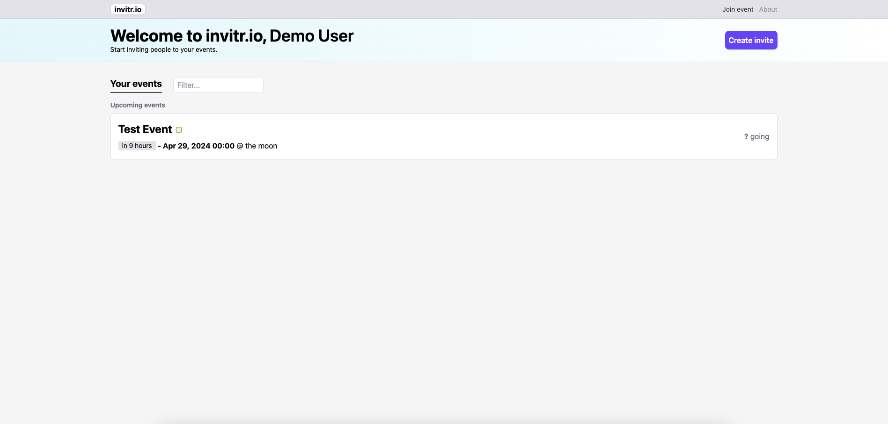

# invitr.io

## A project to make it easier for you to invite people to your events

The idea is to create a nice UI which organisers can log in to and create events, from which they can invite people to. This could be weddings, business meetings, parties, etc... The recipient **SHOULD NOT** need to have an account to accept an invitation; the invitation should come in the form of a: personalised physical invitation or email with link (needs to be safe). Each invite should have a custom passphrase in order for the recipient to enter (for added security). The page that the recipient is taken to should have a big accept or reject button with the option to type a message. It should show where, when, who and when the event is finished, the same page is used for the summary page.



## Getting started

1)  ```
    git clone https://github.com/JackElli/invitr.io.git
    cd invitr.io
    ```
2)  ```
    cp .env.example .env
    ```
3)  ```
    docker-compose up --build -d
    ```
4) Use postman or cURL to send a POST request to `http://localhost:3202/invites/invite` with body
    ```
        {
        "title":"This is a test",
        "organiser":"123", 
        "location":"Manchester", 
        "date":"2024-08-10",
        "passphrase": "welcome",
        "invitees": [{"name":"testuser"}]
        }
    ```
4) To then see the invite send a GET request to 
    ```
    http://localhost:3202/invites/invite/{ID}
    ``` 
    where the ID is the ID in the response from the previous request.

## Future work

- Create UI for the project, make sure it's easy to use, looks beautiful and responds quickly
- Add Google / Apple log in ability
- All calender integration so meetings / events can be added quickly to a users calender (we should also be able to accept / reject from the calender)
- We should have a meeting summary where the organiser can write notes / add images to the webpage and the invitees can access (with the passphrase) and see the highlights of the meeting. It should be very easy to remove if the organiser should choose to delete it.
